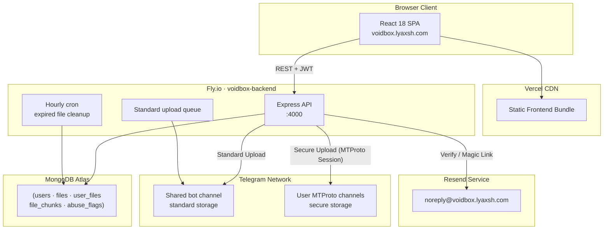
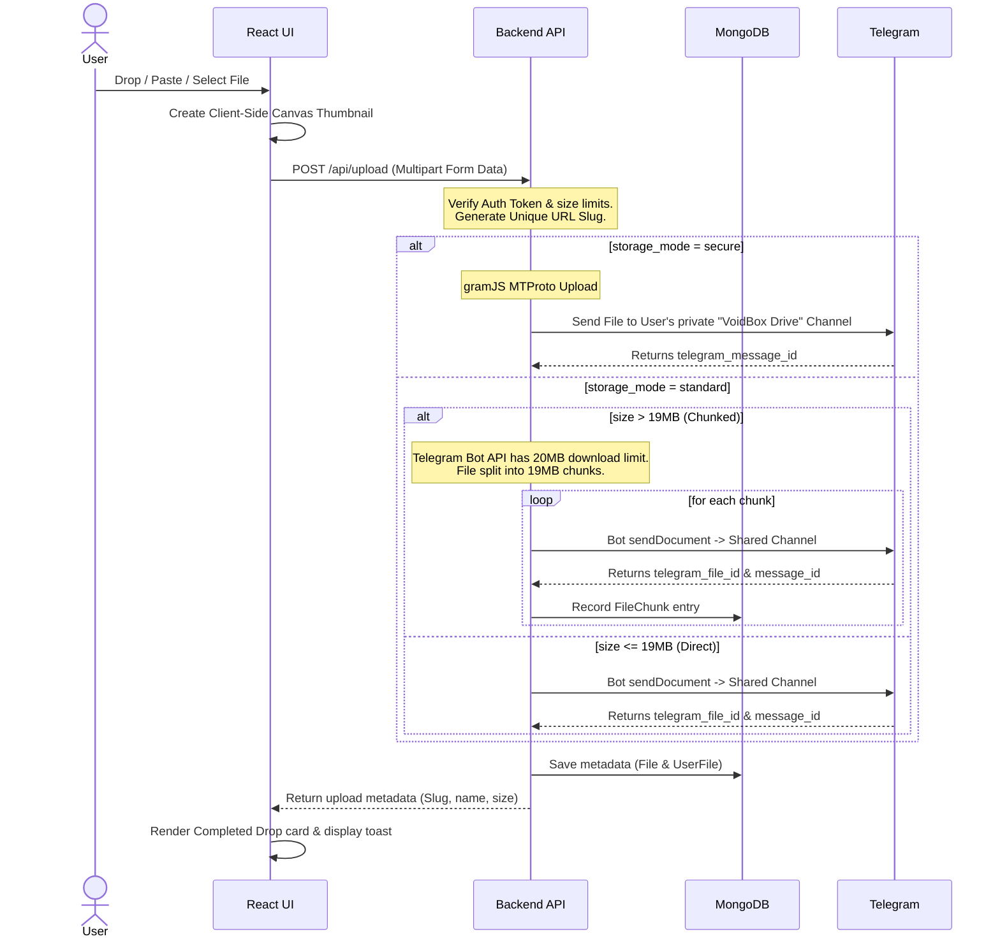
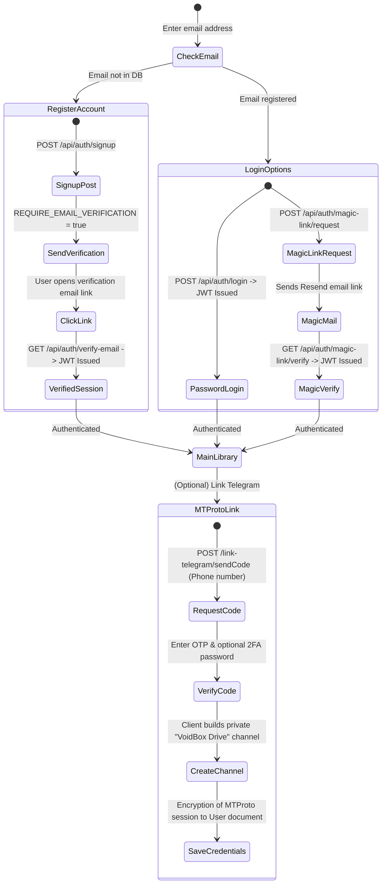
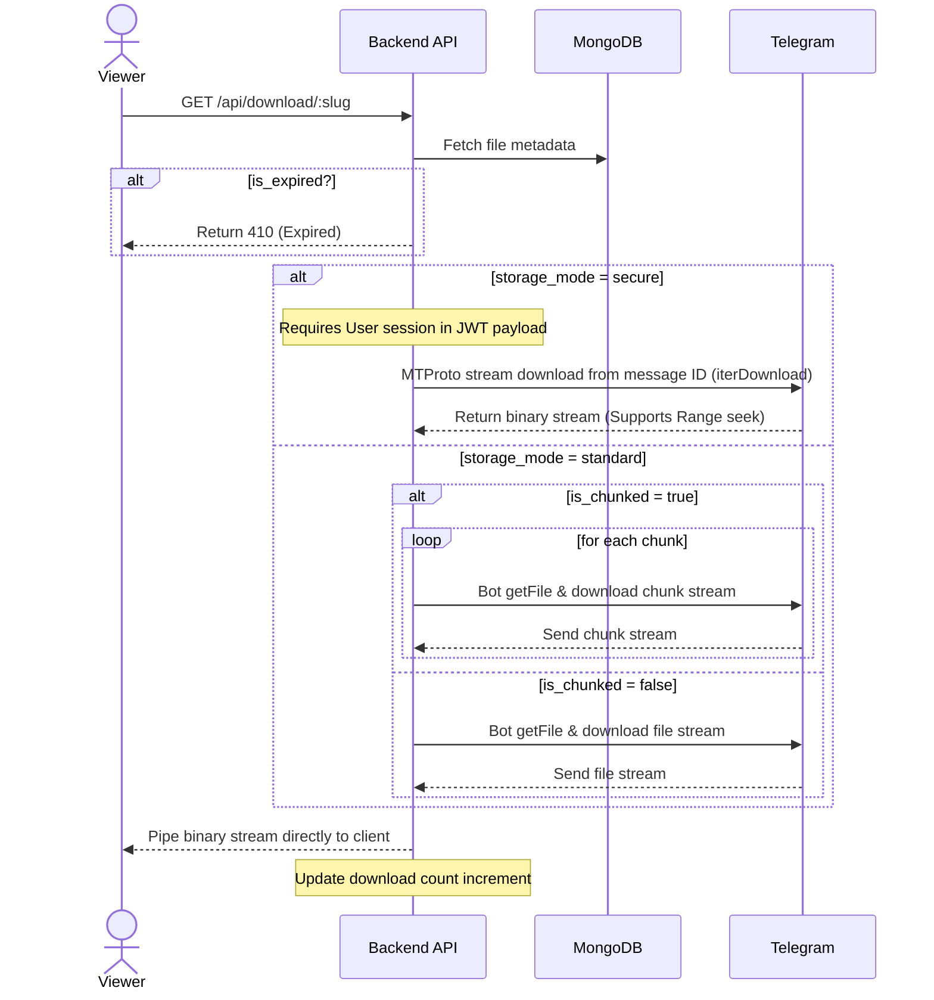

<div align="center">

<picture>
  <source media="(prefers-color-scheme: dark)" srcset="https://raw.githubusercontent.com/lyaxsho/VoidBox/main/frontend/public/darkpro.png">
  <source media="(prefers-color-scheme: light)" srcset="https://raw.githubusercontent.com/lyaxsho/VoidBox/main/frontend/public/lightpro.png">
  
</picture>

# VoidBox — Version ख
## Modern, Privacy-Focused, Telegram-Powered Cloud Storage

VoidBox is an outstanding, secure, and privacy-friendly file and text storage web application that transforms **Telegram** into an infinite, free cloud storage driver. It features a modern React SPA frontend, a TypeScript Express backend, and leverages MongoDB Atlas to map users, files, and channels dynamically.

[Live Demo](https://voidbox.lyaxsh.com) · [Backend API](https://voidbox-backend.fly.dev/api)

---

### 📱 Interface Preview

| **Dashboard (Welcome Screen)** | **Multi-File Upload Queue** |
| :---: | :---: |
|  |  |
| **User Library Dashboard** | **Bulk File Selector** |
|  |  |
| **Interactive File Previewer** | **Mobile Desk Handoff (QR Code)** |
|  |  |

---

</div>

## 🧭 Architecture

VoidBox supports two distinct storage types:
1. **Standard Storage (Shared Bot Channel)**: Uploads are sent to a shared bot channel. Public share links are generated with randomly hashed slugs. Anyone with the URL can view/download.
2. **Secure Storage (User Private Channel)**: Uploads are sent to the user's private channel using their own MTProto session. This ensures maximum privacy, requiring the user's active Telegram authentication to decrypt or stream the content.



---

## ✨ Features

### 🔐 Authentication
*   **Email & Password:** Native authorization with `bcrypt` password hashing and JWT validation (replacing old Supabase Auth).
*   **Email Verification:** Gated access option (`REQUIRE_EMAIL_VERIFICATION=true`) requiring newly signed-up users to confirm their address via transactional verification emails.
*   **Magic Link Sign-In:** One-click email verification login with single-use, 15-minute expiration tokens.
*   **Telegram MTProto Link:** Seamless user linking using an OTP code and optional 2FA password, embedding Telegram session states directly in the user's secure JWT payload.
*   **Password Strength Meter:** Real-time entropy evaluation visualizer with 4-bar indicator and dictionary check.

### 📤 Upload Page
*   **Multi-File Queue:** Concurrent file uploader tracking individual speeds, percentage bars, cancellation triggers, and status badges.
*   **Global Drag & Drop:** Full-screen blurred dropzone overlay triggered anywhere on the page.
*   **Clipboard Insertion:** Paste files or screenshot snapshots directly into the queue via `Ctrl/Cmd + V`.
*   **Auto-Retry Engine:** Automatic recovery for transient issues (5xx/408/429/network errors) using exponential backoff (500ms ➔ 1s ➔ 2s) with random jitter.
*   **Canvas Thumbnails:** Live client-side thumbnail generation for images and videos.
*   **Confirm-on-Leave:** Safety dialog preventing users from accidentally closing the page during ongoing uploads.

### 📚 Personal Library ("My Drops")
*   **Virtual Card List:** Performance-optimized card grids using `content-visibility: auto` to virtualize off-screen files.
*   **Debounced Search:** Instant search filter matching titles, sizes, and file categories with a 180ms debounce threshold.
*   **Responsive Sorting:** Select and sort by Upload Date, File Name, Size, or Extension, with toggleable Ascending/Descending controls.
*   **Bulk Select & Delete:** Mass operations supporting Shift + Click selections and rapid API deletions (up to 100 files simultaneously).
*   **Storage Usage Pill:** Dynamic header visualizer rendering the current allocated data limits.
*   **Expiry Countdown Badges:** Color-coded timers displaying the remaining lifespan of public drops (green ➔ amber ➔ red ➔ expired).
*   **Mobile Enhancements:** Touch-first **Swipe-to-delete** gestures and **Pull-to-refresh** actions.

### 🖼️ Preview Engine & Streaming
*   **Media Players:** Native HTML5 audio and video playback, supporting HTTP Range requests for instant video seeking.
*   **PDF Viewer:** Sandboxed iframe renderer for documents.
*   **ZIP File Explorer:** Previews zip archive indices without forcing a complete file download.
*   **Syntax Highlighting:** Integrated Prism highlighting parser supporting line numbering for over 30 coding languages.
*   **Markdown Renderer:** Instant toggle tab between markdown source and parsed rich-text representation.
*   **QR Code Sharing:** SVG QR code generation for quick file sharing to mobile devices.
*   **Web Share Integration:** Triggers the native mobile OS sharing sheet on touch devices, falling back to clipboard copying on desktop.

### 🛠️ Admin Dashboard
*   **Aggregate Analytics:** Comprehensive charts illustrating total users, verified accounts, active Telegram connections, and overall storage usage.
*   **User Management Sheet:** View, filter, verify, designate admin privileges, unlink Telegram sessions, or remove accounts entirely.
*   **Global File Control:** Browse, search, and delete any standard file drop.

---

## 🗂️ Project Structure

```
VoidBox/
├── backend/
│   ├── src/
│   │   ├── index.ts              # Express initialization & db connection
│   │   ├── routes.ts             # Core business endpoints (Upload, Download, ZIP)
│   │   ├── auth.ts               # Local login, magic link, and MTProto link endpoints
│   │   ├── admin.ts              # Paginated stats and control panel handlers
│   │   ├── models.ts             # Mongoose schemas (File, User, UserFile, chunks)
│   │   ├── telegram.ts           # GramJS MTProto client functions for secure storage
│   │   ├── telegramBot.ts        # Telegram Bot API functions for standard storage
│   │   ├── telegramPool.ts       # GramJS client connection pooling manager
│   │   ├── standardStorage.ts    # Direct & chunked upload distribution logics
│   │   ├── uploadQueue.ts        # Concurrency-controlled standard upload queue
│   │   ├── email.ts              # Resend email templates (Verify & Magic link)
│   │   └── cron.ts               # Expired file cleanup worker
│   ├── Dockerfile
│   ├── fly.toml
│   └── package.json
├── frontend/
│   ├── src/
│   │   ├── components/
│   │   │   ├── HomePage.tsx      # Main greeting lander
│   │   │   ├── UploadPage.tsx    # Drag-drop file queue uploader
│   │   │   ├── LibraryPage.tsx   # Sortable/searchable library dashboard
│   │   │   ├── FilePreviewPage.tsx # Dynamic multimedia content renderer
│   │   │   ├── LoginPage.tsx     # Strength-check forms & magic link portals
│   │   │   ├── AdminPage.tsx     # Platform analytics dashboard
│   │   │   └── Sidebar.tsx       # Desktop layout navigation panel
│   │   ├── hooks/
│   │   │   ├── useAuth.ts        # Client login credentials & token tracker
│   │   │   └── useLocalStorage.ts # Offline settings & state caches
│   │   ├── lib/
│   │   │   └── api.ts            # Client-side endpoint configurations
│   │   ├── App.tsx               # Root layout, routes, and keyboard shortcuts
│   │   └── main.tsx              # React mounting root
│   ├── tailwind.config.js
│   └── package.json
└── readme.md                     # Documentation
```

---

## 🔄 Dynamic Workflows

### 1. Upload Flow (Standard vs. Secure Storage)

VoidBox determines standard vs. secure storage modes based on the user's preferences and linked Telegram accounts:



### 2. Authentication Flow

VoidBox handles native user login, magic link generation, and Telegram account linking:



### 3. File Download & Streaming



---

## ⚙️ Setup & Configuration

### Prerequisites
*   Node.js (v20+ recommended)
*   MongoDB Atlas cluster
*   Telegram account, bot token, and developer credentials (`api_id` & `api_hash` from [my.telegram.org](https://my.telegram.org))
*   Resend API account (for transaction emails)

### Environment Variables

#### Backend Configuration (`backend/.env`)
Create a `.env` file inside the `backend` folder:

```env
# Database
MONGODB_URL=mongodb+srv://<user>:<password>@cluster.mongodb.net/voidbox

# Server
PORT=4000
NODE_ENV=production
FRONTEND_URL=https://voidbox.lyaxsh.com   # Comma-separated for multiple origins

# Secrets
JWT_SECRET=your_jwt_secret_key           # Generate via: openssl rand -hex 64
TEMP_TOKEN_SECRET=your_temp_token_secret
ADMIN_SECRET=your_admin_secret_key

# Email (Resend)
RESEND_API_KEY=re_your_api_key
EMAIL_FROM=VoidBox <noreply@voidbox.lyaxsh.com>
APP_URL=https://voidbox.lyaxsh.com
REQUIRE_EMAIL_VERIFICATION=true

# Telegram API Configuration (Secure Mode)
TG_API_ID=1234567                         # Get from my.telegram.org
TG_API_HASH=your_telegram_api_hash       # Get from my.telegram.org

# Telegram Bot Configuration (Standard Mode)
TELEGRAM_BOT_TOKEN=your_bot_token        # Get from @BotFather
TELEGRAM_CHANNEL_ID=-100xxxxxxxxxx        # ID of your shared Telegram storage channel

# Concurrency
STANDARD_UPLOAD_CONCURRENCY=2
```

#### Frontend Configuration (`frontend/.env`)
Create a `.env` file inside the `frontend` folder:

```env
VITE_BACKEND_URL=https://voidbox-backend.fly.dev/api
```

---

## 🏃 Running Locally

### 1. Start the Backend API
```sh
cd backend
npm install
npm run dev
```
*   The API server will listen on [http://localhost:4000](http://localhost:4000) (or the port defined in your `.env` file).

### 2. Start the Frontend Application
```sh
cd frontend
npm install
npm run dev
```
*   The application client starts at [http://localhost:5173](http://localhost:5173).

---

## 📚 API Endpoints

### 🔑 Authentication Routes
*   `POST /api/auth/check-email` — Check if an email address is already registered.
*   `POST /api/auth/signup` — Register a new account (initiates email verification if enabled).
*   `POST /api/auth/login` — Sign in with credentials, returns a session JWT.
*   `GET  /api/auth/verify-email?token=...` — Verify email via verification link token.
*   `POST /api/auth/resend-verification` — Request a new email verification token.
*   `POST /api/auth/magic-link/request` — Request a one-click magic sign-in link.
*   `GET  /api/auth/magic-link/verify?token=...` — Verify magic link token, signs user in, and auto-verifies email.
*   `GET  /api/auth/me` — Returns the current authenticated user's profile and active settings.
*   `POST /api/auth/link-telegram/sendCode` — Initiates secure Telegram MTProto linking.
*   `POST /api/auth/link-telegram/verify` — Validates the Telegram OTP code and optional 2FA password to save the session.
*   `DELETE /api/auth/link-telegram` — Removes active Telegram session integrations.
*   `PATCH /api/auth/secure-upload` — Toggle user's default storage mode (Standard vs. Secure).
*   `GET  /api/auth/queue-status` — Retrieve current job status for standard file uploads.

### 📁 File & Storage Routes
*   `POST /api/upload` — Upload files or text notes (configured with multi-file headers).
*   `GET  /api/file/:slug` — Retrieve basic file metadata.
*   `GET  /api/download/:slug` — Download or stream target file.
*   `GET  /api/note-content/:slug` — Fetch raw contents of text note drops.
*   `GET  /api/zip-list/:slug` — List file index entries of zip archives.
*   `GET  /api/mydrops` — List all files and notes uploaded by the current user.
*   `DELETE /api/mydrops/:slug` — Delete a specific file.
*   `POST /api/mydrops/bulk-delete` — Batch deletion endpoint (supports up to 100 slugs).
*   `POST /api/flag` — Flag drops for abuse.
*   `GET  /api/upload-progress/:uploadId` — Poll status/progress of background chunk processing.

### 🛡️ Admin Routes
*   `GET  /api/admin/stats` — Retrieve global system counts and storage metrics.
*   `GET  /api/admin/users` — Fetch a paginated list of registered users.
*   `PATCH /api/admin/users/:id` — Perform administrative actions on a user (`verify_email`, `toggle_admin`, `unlink_telegram`).
*   `DELETE /api/admin/users/:id` — Delete a user and clean up all their files.
*   `GET  /api/admin/files` — Fetch a paginated list of all public standard files.
*   `DELETE /api/admin/files/:id` — Remove a file from standard storage.

---

## 🚀 Deployment

### Backend Service (Fly.io / Railway / Render)
Deploy using the provided `Dockerfile`. For Fly.io:
```sh
cd backend
fly launch
```
Make sure to configure all environment variables under your hosting provider's dashboard settings.

### Frontend Client (Vercel / Netlify)
Connect your repository and point the build configuration to the `frontend/` folder:
*   **Build Command:** `npm run build`
*   **Output Directory:** `dist`
*   **Build Environment Variable:** `VITE_BACKEND_URL=https://your-backend-api.com/api`

---

## 🤝 Contributing
1. Fork the Repository.
2. Create your Feature Branch (`git checkout -b feature/AmazingFeature`).
3. Commit your changes (`git commit -m 'Add some AmazingFeature'`).
4. Push to the Branch (`git push origin feature/AmazingFeature`).
5. Open a Pull Request.

---

## 🏅 Credits

- Developed by [lyaxsho](https://www.github.com/lyaxsho) // [contact@lyaxsh.com](mailto:contact@lyaxsh.com) 
- Assisted by [Tanmay Singh](https://www.github.com/tanmaysingh3856)

---
<div align="center">
  Generated with 🤍 for the Open Source Community.
</div>
